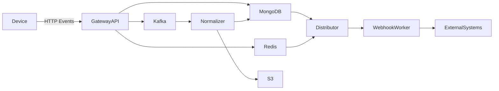
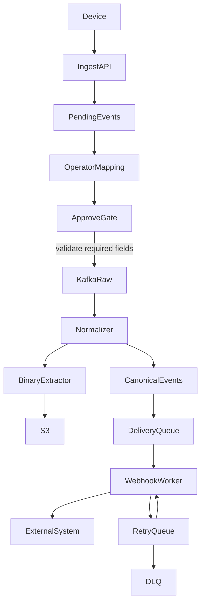
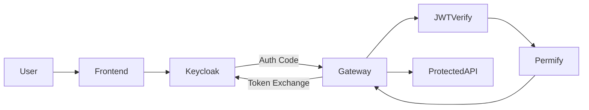

# Gateway API — Baseline Architecture

> Last updated: 2026-03-06

---

## Core Principles

Every `.go` file **must** have a path comment on line 1.

```go
// controllers/ingestctl/management.go
package ingestctl

// internal/services/ingestsvc/approve.go
package ingestsvc
```

---

## Architecture Flow

```
repo → service → controller → router
```

| Layer | Responsibility |
|---|---|
| `router` | Route definition + middleware only |
| `controller` | HTTP layer — parse request, call service, write response |
| `service` | Business logic |
| `repo` | Database access |

**Forbidden cross-calls:**

- `controller` → `repo` ❌
- `router` → `repo` ❌
- `repo` → `service` ❌
- `router` → `EnsureIndexes` ❌
- `router` → business logic ❌

---

## Service Package Layout — Errors & Types

Service packages define their own `errors.go` and `types.go`.  
These are the **public contract** of the service — controllers and callers use them.  
`models/` packages are used internally for DB/domain shapes only.

```
internal/services/ingestsvc/
  receive.go       ← business logic
  approve.go
  bulk.go
  mapping.go
  errors.go        ← sentinel errors for this service
  types.go         ← input/output types specific to this service
```

### `errors.go` pattern

```go
// internal/services/ingestsvc/errors.go
package ingestsvc

import "errors"

var (
    ErrEventNotFound    = errors.New("event not found")
    ErrAlreadyApproved  = errors.New("event already approved")
    ErrMappingRequired  = errors.New("mapping required before approval")
    ErrTemplateNotFound = errors.New("template not found")
)
```

### `types.go` pattern

```go
// internal/services/ingestsvc/types.go
package ingestsvc

type ApproveResult struct {
    EventId     string
    KafkaTopic  string
    PublishedAt string
}

type MappingValidationError struct {
    MissingTargets []string
    InvalidTargets []string
}

func (e *MappingValidationError) Error() string { return "mapping validation failed" }

type BulkResult struct {
    Succeeded []string
    Failed    []BulkFailItem
}

type BulkFailItem struct {
    EventId string
    Reason  string
}
```

### Controller error mapping pattern

```go
// internal/controllers/ingestctl/management.go
switch {
case errors.Is(err, ingestsvc.ErrEventNotFound):
    return httputil.FailReason(c, fiber.StatusNotFound, "NOT_FOUND", err.Error())
case errors.Is(err, ingestsvc.ErrMappingRequired):
    var ve *ingestsvc.MappingValidationError
    if errors.As(err, &ve) {
        return c.Status(422).JSON(fiber.Map{
            "code":   "MAPPING_REQUIRED",
            "status": false,
            "details": fiber.Map{
                "missingTargets": ve.MissingTargets,
                "invalidTargets": ve.InvalidTargets,
            },
        })
    }
case errors.Is(err, ingestsvc.ErrAlreadyApproved):
    return httputil.FailReason(c, fiber.StatusConflict, "ALREADY_APPROVED", err.Error())
}
```

**Rules:**
- `errors.go` / `types.go` belong to the **service package** — not `models/`
- `models/` = domain data structures (DB shape)
- Service types = operation inputs/outputs flowing between service → controller
- Gateway packages (`internal/gateways/*`) follow the same pattern
- Never import `fiber` / `net/http` inside service layer

---

## API Response Standard

```json
{
  "code": "SUCCESS",
  "message": "events fetched successfully",
  "status": true,
  "details": [],
  "pagination": {
    "page": 1,
    "perPages": 10,
    "totalRecords": 0,
    "totalPages": 0,
    "sortField": "createdAt",
    "sortOrder": "desc"
  }
}
```

- Always `details` (never `detail`)
- `pagination` optional — omit on non-list endpoints
- Use `gmod.SendPaginationOK` for consistent envelope
- Use `gmod.CodedError` / `gmod.Errorf(code, msg)` for coded errors
- Use `httputil.FailReason(...)` for HTTP error responses

---

## Query Parameters

| Param | Default | Notes |
|---|---|---|
| `page` | 1 | |
| `perPages` | 10 | clamped max 250 via `utils.PerPage()` |
| `sortField` | `createdAt` | |
| `sortOrder` | `desc` | |
| `search` | — | regex by `name`, case-insensitive |
| `dateTime` | — | `from,to` RFC3339 UTC |

Mongo search — always escape (ReDoS risk):

```go
primitive.Regex{Pattern: regexp.QuoteMeta(search), Options: "i"}
```

---

## DateTime Standard

All timestamps **RFC3339 UTC** — `2026-01-20T16:59:59Z`

---

## Required Headers

```
Authorization: Bearer <jwt>
X-Active-Org:  <orgId>
```

---

## MongoDB Naming

- Collections: `snake_case`
- Fields: `camelCase`

| Deprecated | Replace with |
|---|---|
| `dateTimeCreate` | `createdAt` |
| `dateTimeUpdate` | `updatedAt` |
| `long` | `lng` |

---

## Logging

### Setup

Logger at `internal/logger/` using `zerolog`. Init once at startup via `logger.Init()`.

ENV vars:

| Var | Default | Values |
|---|---|---|
| `LOG_LEVEL` | `info` | `trace`, `debug`, `info`, `warn`, `error` |
| `LOG_PRETTY` | `false` | `true` for console output (dev only) |
| `LOG_CALLER` | `false` | `true` to include file:line |
| `LOG_DEV_COMPONENT` | `""` | component name to focus dev logging (see below) |

### Log level visibility

`LOG_LEVEL` is a **minimum threshold** — everything at that level and above is shown:

| `LOG_LEVEL` set to | Levels visible |
|---|---|
| `trace` | trace + debug + info + warn + error |
| `debug` | debug + info + warn + error |
| `info` | info + warn + error |
| `warn` | warn + error |
| `error` | error only |

Production default: `info`

### Dev-focused logging — `logger.Dev`

Problem: setting `LOG_LEVEL=trace` globally shows noise from all components, including requests from other developers testing at the same time.

Solution: `logger.Dev(ctx, component, source)` — emits trace-level logs **only for the component you are currently implementing**. All other components remain at their normal level.

```go
// internal/logger/dev.go
package logger

// Dev returns a trace-level logger ONLY when LOG_DEV_COMPONENT matches component.
// If env is unset or does not match → returns zerolog.Nop() — zero cost, completely silent.
//
// ⚠️  Replace all logger.Dev(...) with logger.FromCtx(...) before merging to main.
func Dev(ctx context.Context, component, source string) zerolog.Logger {
    target := strings.TrimSpace(os.Getenv("LOG_DEV_COMPONENT"))
    if target == "" || target != component {
        return zerolog.Nop()
    }
    return FromCtx(ctx, component, source).Level(zerolog.TraceLevel)
}
```

**Workflow:**

```bash
# .env.local — focused on the component you are building
LOG_LEVEL=info               # global stays info — other devs not affected
LOG_DEV_COMPONENT=ingestsvc  # only ingestsvc emits trace logs
```

```go
// During implementation — use logger.Dev
func (s *svc) Approve(ctx context.Context, orgId, eventId string) (*ApproveResult, error) {
    log := logger.Dev(ctx, "ingestsvc", "approve")

    log.Trace().Str("eventId", eventId).Msg("approve_start")
    // ... every branch, every variable
    log.Trace().Any("event", event).Msg("event_fetched")
    log.Trace().Strs("missing", missing).Msg("validation_result")
}

// After implementation stabilizes — replace with FromCtx + appropriate level
func (s *svc) Approve(ctx context.Context, orgId, eventId string) (*ApproveResult, error) {
    log := logger.FromCtx(ctx, "ingestsvc", "approve")

    log.Info().Str("eventId", eventId).Msg("approve_start")
    log.Info().Str("eventId", eventId).Str("topic", topic).Msg("event_approved")
}
```

**Rules:**
- `logger.Dev` is **dev-only** — must not exist in any file merged to `main`
- PR checklist must include: "no `logger.Dev` calls remain"
- `zerolog.Nop()` is zero-allocation — safe to leave in code during development without performance impact

### Production logger usage

**In handlers / service / repo** — `FromCtx` to carry traceId/spanId:

```go
log := logger.FromCtx(ctx, "ingestsvc", "approve")
log.Info().Str("eventId", id).Msg("event_approved")
```

**In boot / init / jobs** — `WithMeta` or `Boot` (no context yet):

```go
log := logger.Boot("config", "mongo-bootstrap")
log.Info().Msg("indexes_ensured")
```

### Log level guide

| Level | When to use |
|---|---|
| `TRACE` | (dev only via `logger.Dev`) every branch, every variable |
| `DEBUG` | Reads (list/get), hot-path per-event ingest, template match result |
| `INFO` | Mutations: approve, reject, delete, create/update/delete template, bulk ops |
| `WARN` | Expected client/state errors: not found, conflict, rate limit, gate blocked, missing fields |
| `ERROR` | System failures: DB write failed, Kafka publish failed |

**Ingest hot-path rule:** every per-event log in `POST /events/:orgId` and auto-match fingerprint paths uses `Debug` to avoid production noise at high throughput.

**Rule: log once at boundary.**
Service returns clean error → controller logs + responds. Never log the same error in both layers.

```go
// ✅ service returns clean error
return nil, ingestsvc.ErrMappingRequired

// ✅ controller logs + responds
log.Warn().Err(err).Str("eventId", id).Msg("approve_rejected")
return httputil.FailReason(c, 422, "MAPPING_REQUIRED", err.Error())

// ❌ both service and controller log the same error
```

**HTTP request log** — provided by `logger.FiberLogger()` middleware:

```
method=POST path=/api/v1/ingest/management/xxx/approve status=200 ip=... latency=12ms
```

---

## Tracing (OpenTelemetry)

### Setup

Config at `config/otel.go`. Tracer initialized at app start.  
Propagation via standard W3C `traceparent` header.

### Middleware

`middleware.TraceHeader()` — injects `X-Trace-Id` and `X-Span-Id` into response headers and `c.Locals`.

```go
// router: apply before other middlewares
app.Use(middleware.TraceHeader())
```

### Usage in service/repo

Use `traceutil` from `utils/traceutil/`:

```go
// utils/traceutil/scope.go — lightweight span helper
ctx, end, log := traceutil.StartLite(
    c.UserContext(),
    "gateway.ingestapi",
    "GetIngestDashboard",
    "ingestapi",
    "GetIngestDashboard",
)
defer end()

แล้ว service layer ควรใช้ child span
เช่น

func (s *DashboardStatsService) GetIngestDashboardStats(
    ctx context.Context,
    input *ingestmod.GetIngestDashboardInput,
) (*Stats, error) {

    ctx, end, log := traceutil.StartLite(
        ctx,
        "gateway.ingeststatsvc",
        "GetIngestDashboardStats",
        "ingeststatsvc",
        "GetIngestDashboardStats",
    )
    defer end()

    ...

log.Info().Str("eventId", id).Msg("approval_started")
```


`StartLite` returns:
- `ctx` — child context with active span
- `end` — `defer end()` closes the span
- `log` — zerolog logger pre-enriched with `traceId` + `spanId`

**Rule:** always pass `ctx context.Context` as the first argument through every layer (handler → service → repo) so tracing propagates correctly.

```go
// ✅ correct
func (s *ingestSvc) Approve(ctx context.Context, eventId string) (*ApproveResult, error)

// ❌ no context — breaks tracing
func (s *ingestSvc) Approve(eventId string) (*ApproveResult, error)
```

---

## Audit Logging

### How it works

`middleware.Audit(cfg)` at `internal/middleware/audit.go`:

1. Applies only to `POST`, `PUT`, `PATCH`, `DELETE`
2. Matches request path against `auditPrefixes` (longest-prefix-first)
3. Runs `c.Next()` first, then captures status + latency
4. Persists async via `go persistAudit(...)` — never blocks response

### Adding a new audited path

In `audit.go`, add to `auditPrefixes`:

```go
{"/ingest/management", "ingestManagement"},
{"/ingest/mappingTemplates", "ingestMappingTemplates"},
```

Prefixes are sorted longest-first automatically at `init()`.

### Config

```go
// inject in main.go / container
auditCfg := middleware.AuditConfig{
    AuditRepo: authzrepo.NewAuditLogRepo(config.DB),
    BasePath:  "/api/v1",
    Effective: middleware.EffectiveGetter(), // dynamic — reads AuditCaptureResponse policy
}
app.Use(middleware.Audit(auditCfg))
```

Dynamic policy from `EffectiveConfig`:

| Field | Values | Effect |
|---|---|---|
| `AuditCaptureResponse` | `none` / `errors` / `all` | When to capture response body |
| `AuditMaxRespBytes` | int (default 16384) | Max bytes to capture |
| `AuditCaptureJSONOnly` | bool | Skip non-JSON responses |

### Sensitive field redact

`redact()` masks keys containing: `password`, `token`, `secret`, `authorization`.  
Add keys to `redact()` in `audit.go` if more fields need masking.

### Audit document shape

```json
{
  "actorType": "user",
  "actorId": "uuid",
  "actorName": "operator1",
  "actorIp": "49.228.x.x",
  "operation": "ingestManagement",
  "resource": "/ingest/management/xxx/approve",
  "method": "POST",
  "status": 200,
  "payload": { "note": "approved" },
  "latencyMs": 45,
  "traceId": "abc123",
  "createdAt": "2026-03-06T05:19:42Z"
}
```

---

## Middleware Stack

Standard middleware order for protected routes:

```go
// router/ingest.go
ingest := app.Group("/api/v1/ingest")
ingest.Use(
    middleware.TraceHeader(),       // 1. inject X-Trace-Id to response
    logger.FiberLogger(),           // 2. HTTP access log
    middleware.AuthBearer(),        // 3. validate JWT → set userId, tenantId, user locals
    middleware.ActiveOrg(),         // 4. validate X-Active-Org via Permify gRPC
    middleware.Audit(auditCfg),     // 5. audit (runs after c.Next())
)
```

Available middlewares:

| Middleware | File | Purpose |
|---|---|---|
| `TraceHeader()` | `tracehdr.go` | Inject trace/span IDs to response |
| `FiberLogger()` | `logger/middleware.go` | HTTP access log |
| `AuthBearer()` | `auth.go` | JWT validation, set `userId`/`tenantId` locals |
| `AuthBearerOrCookie()` | `auth.go` | JWT or `KAPI_TOKEN` cookie |
| `ActiveOrg()` | `activeorg.go` | Validate `X-Active-Org` via Permify |
| `Audit(cfg)` | `audit.go` | Async audit logging |
| `AllowMethods(...)` | `method.go` | Restrict allowed HTTP methods |
| `RequireRoles(...)` | `auth.go` | Role-based access from JWT |

> `AllowOnly()` is deprecated — use `AllowMethods()` instead.

### Reading locals set by middleware

```go
// in controller
userId    := c.Locals("userId").(string)
tenantId  := c.Locals("tenantId").(string)
activeOrg := c.Locals("activeOrg").(string)
traceId   := c.Locals("traceId").(string)
```

---

## Swagger

### Annotations

Use `swag` annotations on controller functions. File must start with path comment.

```go
// internal/controllers/ingestctl/management.go
package ingestctl

// @Summary      List pending events
// @Description  Returns paginated list of pending ingest events for the active org
// @Tags         ingest-management
// @Accept       json
// @Produce      json
// @Security     BearerAuth
// @Param        X-Active-Org  header    string  true   "Active Org ID"
// @Param        page          query     int     false  "Page number"        default(1)
// @Param        perPages      query     int     false  "Items per page"     default(10)
// @Param        search        query     string  false  "Search by name"
// @Param        sortField     query     string  false  "Sort field"         default(createdAt)
// @Param        sortOrder     query     string  false  "Sort order"         default(desc)
// @Success      200  {object}  gmod.PaginationResponse
// @Failure      401  {object}  gmod.ApiErrorResponse
// @Failure      403  {object}  gmod.ApiErrorResponse
// @Router       /api/v1/ingest/management [get]
func (h *IngestManagementHandler) List(c *fiber.Ctx) error {
```

### Tags naming convention

Group by domain + sub-resource:

```
ingest                   ← hot-path event ingestion (no auth)
ingest-management        ← pending event CRUD + approve/reject/delete
ingest-bulk              ← bulk approve/reject/delete/applyTemplate
ingest-details           ← approved canonical event read endpoints
ingest-mapping-templates ← mapping template CRUD
ingest-dashboard         ← aggregated stats
ingest-dlq               ← dead-letter queue (future)
```

### Generate docs

```bash
swag init -g main.go --output docs/
```

### Rules

- Every public endpoint **must** have swagger annotations
- `@Security BearerAuth` on every protected endpoint
- `@Param X-Active-Org header` on every org-scoped endpoint
- Use `{object}` with concrete types — never `interface{}`
- Response models go in `models/` or service `types.go` — annotate the actual struct

---

## Kafka

### Structure

```
internal/kafka/
  producer.go          ← shared producer (singleton)
  consumer.go          ← consumer base/runner
  atacons/             ← ATA device events consumer
  authzcons/           ← Authz membership/relationship consumers
  iwowncons/           ← iWown events consumer
  kaicons/             ← KAI detection consumer
  kctrlcons/           ← KControl alarm/event/health/sensor consumers
  klivecorns/          ← KLive ZKT consumer
  kschcorns/           ← KScheduler video consumer
  kwatchcons/          ← KWatch watchlist consumer
  kwatchpub/           ← KWatch publisher
  normalizedcons/      ← normalized canonical events consumer
```

### Publishing (ingest approve → raw.events)

```go
// internal/kafka/producer.go — use shared producer
producer := kafka.GetProducer() // singleton from config
err = producer.Publish(ctx, "raw.events", eventId, payload)
```

### Consumer pattern

Each consumer package owns its own handler. Register in container wiring.

```go
// internal/kafka/kctrlcons/event.go
func StartEventConsumer(ctx context.Context, svc somesvc.Service) {
    consumer := kafka.NewConsumer(config.KafkaConfig(), "raw.events", "gateway-ingest-group")
    consumer.Run(ctx, func(msg kafka.Message) error {
        return handleEvent(ctx, svc, msg)
    })
}
```

**Rules:**
- Producer is a singleton — get via `kafka.GetProducer()`
- Each consumer has its own consumer group ID
- Never publish to Kafka from repo layer — only from service layer
- Kafka publish failure must be logged at `ERROR` and returned as error (not swallowed)

---

## MQTT

```
internal/mqtt/
  inframsg/      ← infra status messages
  kcontrolmsg/   ← KControl device messages (handler, watchdog)
  kwatchmsg/     ← KWatch watchlist messages
```

Pattern: each subdomain owns `init.go` (subscribe setup) and `publish.go` / `handler.go`.  
MQTT is used for device-side real-time control messages — not for event ingestion pipeline.

---

## Crypto

`internal/crypto/secretbox/` — symmetric encryption for sensitive stored values (e.g. passwords, API keys).

```go
// encrypt before storing
box := secretbox.New() // key from ENV via keyringENV.go
ciphertext, err := box.Seal(plaintext)

// decrypt after reading
plaintext, err := box.Open(ciphertext)
```

**Rule:** use `secretbox` for any field stored in MongoDB that is a credential or secret.  
Never store plaintext passwords or API keys — always seal before insert, open after read.

---

## Wiring — `internal/app/container.go`

`container.go` is the **dependency injection root**. All repos, services, controllers, and consumers are wired here. Nothing creates its own dependencies — everything is passed in.

### Pattern

```go
// internal/app/container.go
package app

type Container struct {
    // repos
    PendingEventRepo   ingestrepo.PendingEventRepo
    MappingTemplateRepo ingestrepo.MappingTemplateRepo

    // services
    IngestSvc   ingestsvc.Service
    TemplateSvc templatesvc.Service

    // controllers
    IngestCtl   *ingestctl.Handler
    TemplateCtl *templatectl.Handler
}

func NewContainer() *Container {
    // repos
    pendingRepo := ingestrepo.NewPendingEventRepo(config.DB)
    templateRepo := ingestrepo.NewMappingTemplateRepo(config.DB)

    // services
    ingestSvc := ingestsvc.New(pendingRepo, templateRepo, kafka.GetProducer())
    templateSvc := templatesvc.New(templateRepo)

    // controllers
    return &Container{
        PendingEventRepo:    pendingRepo,
        MappingTemplateRepo: templateRepo,
        IngestSvc:           ingestSvc,
        TemplateSvc:         templateSvc,
        IngestCtl:           ingestctl.New(ingestSvc),
        TemplateCtl:         templatectl.New(templateSvc),
    }
}
```

### Startup order in `main.go`

```go
func main() {
    logger.Init()           // 1. logger first
    config.InitMongo()      // 2. mongo + bootstrap (EnsureIndexes)
    config.InitRedis()      // 3. redis
    config.InitKafka()      // 4. kafka
    config.InitOtel()       // 5. tracing

    c := app.NewContainer() // 6. wire everything

    // 7. start consumers
    go kafka.StartNormalizedConsumer(ctx, c.SomeSvc)

    // 8. start HTTP last
    router.Init(c)
    app.Listen(":8080")
}
```

**Rules:**
- `config.InitMongo()` must run before `NewContainer()` — repos need `config.DB`
- Consumers start **after** container is built
- HTTP starts **last**
- Never use `init()` in router or controller to create deps — use container

---

## Infrastructure Inventory

### MongoDB — `internal/repo/stomongo/`

Thin wrapper around `mongo-driver`. Always use this — never write raw mongo calls in repo.

| File | Purpose |
|---|---|
| `find.go` | Find many with filter |
| `findOne.go` / `findOneOpts.go` | Find single document |
| `findPaginated.go` | Find with pagination result |
| `pagination.go` | Pagination struct + helpers |
| `insertOne.go` / `insertMany.go` | Insert operations |
| `update.go` | UpdateOne/Many with auto `updatedAt` |
| `updateOpsMore.go` | Extended update ops |
| `updateError.go` | Update error types |
| `delete.go` / `softDelete.go` | Hard and soft delete |
| `bulk.go` / `bulkExtras.go` | Bulk write operations |
| `upsertByFilter.go` | Upsert helper |
| `aggregate.go` | Aggregation pipeline |
| `pipeline.go` | Pipeline builder |
| `count.go` | Count documents |
| `index.go` / `indexExtra.go` | Index creation helpers |
| `tx.go` | Transaction wrapper |
| `common.go` / `external.go` | Shared + external-facing types |

**Key rules:**
- `UpdateOneOps` with only `$unset` will NOT touch `updatedAt` — add `$set: {updatedAt: now}` explicitly
- Always use `findPaginated` for list endpoints — never manually skip/limit

### S3 — `internal/repo/stos3minio/`

| File | Purpose |
|---|---|
| `upload.go` | Upload object |
| `download.go` | Download object |
| `get.go` | Get object metadata/stat |
| `presign.go` | PresignOnce / PresignMany (expiry from `S3_EXPIRY` env) |
| `delete.go` / `deleteByKey.go` | Delete by key |
| `helpers.go` / `util.go` | Key normalization |

**Security:** always enforce org ownership before generating presigned URL.

### External Gateways — `internal/gateways/`

Call from service layer only — never from repo.  
Each gateway owns its `errors.go` + `types.go`.

| Package | Purpose |
|---|---|
| `authgw` | Keycloak — token exchange, OAuth, users, roles |
| `authzgw` | Permify — gRPC + REST authorization |
| `atagw` | ATA device integration |
| `mediagw` | Media service |
| `webhookgw` | Outbound webhook delivery |
| `linegw` / `telegw` / `discordgw` | Notification channels |
| `iboc/watchlist/ibface` | IBOC face watchlist |
| `watchman/watchgw` | Watchman 3rd-party watchlist sync |
| `svms` | SVMS integration |
| `gwcom` | Shared HTTP client base |

### Config — `config/`

| File | Purpose |
|---|---|
| `mongo.go` | MongoDB client + `RegisterMongoBootstrap` + `InitMongo` |
| `kafka.go` | Kafka producer/consumer config |
| `redis.go` | Redis client |
| `s3.go` | MinIO/S3 client |
| `masterconf.go` | Master env config loader |
| `otel.go` | OpenTelemetry tracer |
| `permifyRest.go` / `permifygRPC.go` | Permify client config |
| `ataconf.go` | ATA-specific config |
| `llm.go` | LLM config |

### Utils — `utils/`

Cross-domain shared utilities only.  
**Specific to one service → keep inside that service package.**

| Package / File | Purpose |
|---|---|
| `httputil/` | `error.go`, `success.go`, `request.go`, `retry.go` |
| `authutil/` | JWT, JWKS, token, tenant, realm extraction |
| `traceutil/` | OTel trace/span helpers (`StartLite`) |
| `typeutil/` | Generic type conversion |
| `aiutil/` | AI/ML helpers (ATA, IBOC, LPR) |
| `cryptoutil.go` | Hashing, encryption |
| `envutil.go` | Env var helpers |
| `perpage.go` | `PerPage(n)` — clamp to max 250 |
| `validator.go` | Shared validation |
| `time.go` | RFC3339 UTC helpers |
| `permissions.go` | Permission string helpers |
| `kliveutil/` | K-Live session helpers |

---

## MongoDB Index Bootstrap

**Rule: index creation in bootstrap only — never in router/controller/service.**

```go
// internal/repo/ingestrepo/mongoBootstrap.go
package ingestrepo

import (
    "context"
    "github.com/hotkhwan/gateway-api/config"
)

func init() {
    config.RegisterMongoBootstrap(func(ctx context.Context) error {
        if err := NewPendingEventRepo(config.DB).EnsureIndexes(ctx); err != nil {
            return err
        }
        if err := NewMappingTemplateRepo(config.DB).EnsureIndexes(ctx); err != nil {
            return err
        }
        return nil
    })
}
```

- `config.InitMongo()` before `InitHTTP()` always
- TTL index declared inside `EnsureIndexes()` only
- Bootstrap is idempotent
- Package must be imported (blank `_`) at startup to trigger `init()`

---

## Audit Logging

Apply to: `POST` · `PUT` · `PATCH` · `DELETE`

```json
{
  "actorType": "user",
  "actorId": "uuid",
  "actorName": "operator1",
  "actorIp": "49.228.x.x",
  "operation": "ingestManagement",
  "resource": "/ingest/management/xxx/approve",
  "method": "POST",
  "status": 200,
  "payload": { "note": "approved" },
  "latencyMs": 45,
  "traceId": "abc123",
  "createdAt": "2026-03-06T05:19:42Z"
}
```

Sensitive fields masked: `password`, `token`, `secret`, `authorization`.

---

## Event Pipeline

```
external device
  → POST /events/:orgId
  → event_management (statusName: "pending")

      ┌─ fingerprint match? (Redis cache of org templates)
      │     YES → auto-apply template field mappings
      │           → auto-approve (ApproveEvent with updates)
      │           → Kafka raw.events  ──────────────────────┐
      │                                                       │
      └─ NO  → operator reviews pending event               │
                 │                                            │
                 ├─ manual: PATCH /:eventId (set eventType)  │
                 │  POST /:eventId/approve                    │
                 │  (approval gate: eventType required)       │
                 │  → Kafka raw.events  ─────────────────────┤
                 │                                            │
                 └─ bulk:  POST /management/bulk/approve      │
                           POST /management/bulk/applyTemplate│
                           → Kafka raw.events  ───────────────┘

  → normalizer service consumes raw.events
  → builds CanonicalEvent → canonical_events (MongoDB)
  → S3 binary storage

  → delivery workers
  → webhook / retry / DLQ
```

### Fingerprint auto-match flow

1. `IngestService.Ingest` receives raw payload, stores as pending event.
2. `TemplateMatcher.Match` looks up org templates from Redis fingerprint cache.
3. On cache miss → loads templates from MongoDB, refreshes cache.
4. If a template `match` rule hits → `ApplyMappings` extracts `eventType`, `name`, lat/lng.
5. `ApprovalService.ApproveEvent` called with mapped updates → approval gate runs → publishes to `raw.events`.
6. On no match → event stays pending, operator resolves manually or via bulk.

### Bulk flow

- Up to 100 event IDs per request.
- `BulkApplyTemplate` loads the template once, applies mappings per event, auto-approves each.
- Per-event partial success: `BulkResult.Succeeded` + `BulkResult.Failed` returned regardless of individual failures.

---

## C4 Container Diagram



---

## Kafka Event Pipeline



---

## Security Flow (Keycloak + Permify)


