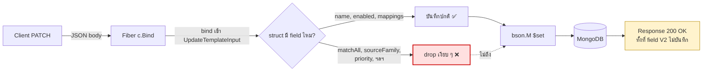
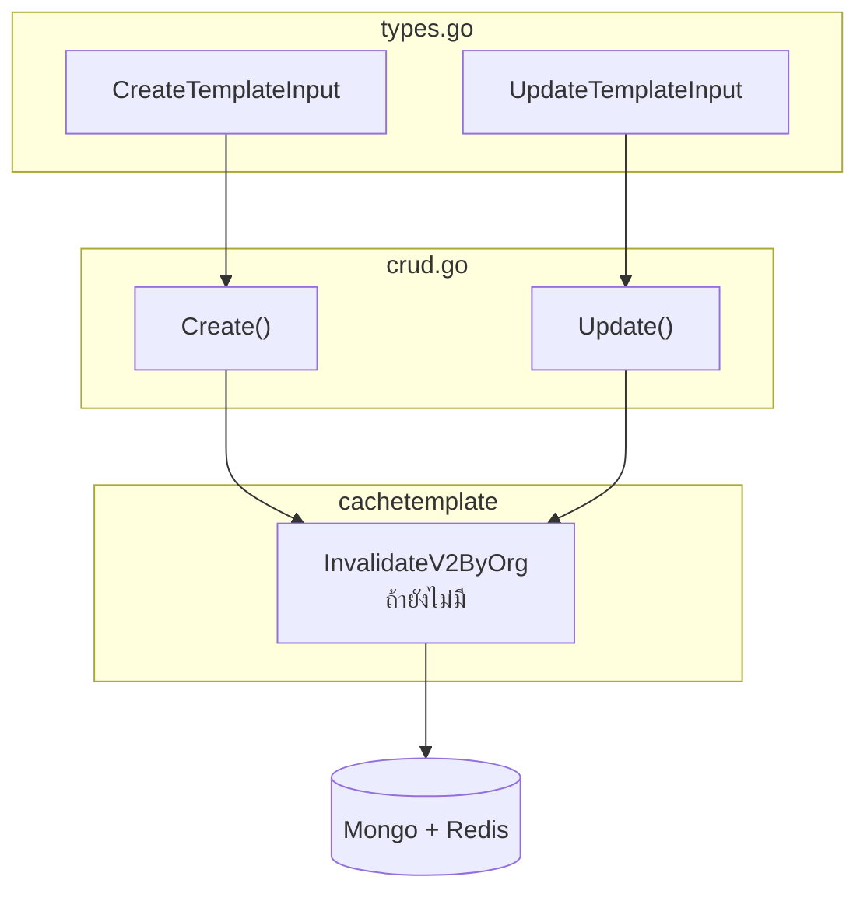
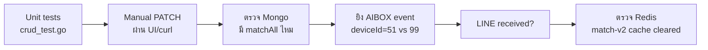

// docs/plan/deliver_template.md

# 🚑 Plan: Fix Template PATCH — `matchAll` / V2 fields หาย

> **TL;DR** — PATCH template ตอบ `200 OK` แต่ field V2 (`matchAll`, `sourceFamily`, ฯลฯ) ไม่ลง Mongo เพราะ input struct ในฝั่ง service ขาด field → Fiber bind drop เงียบ ๆ. ผลคือ LINE delivery filter ตาม `deviceId` ไม่ทำงาน ทุก event ของ sourceFamily ถูก forward หมด. แก้โดยเพิ่ม field ใน `CreateTemplateInput` / `UpdateTemplateInput` + wire ลง `bson.M` ใน `Update()` และ `MappingTemplate` ใน `Create()`.

| 📅 Date | 🎯 Scope | 🏷️ Type | 🔥 Severity |
|---|---|---|---|
| 2026-04-20 | `gateway-api` · `internal/services/templatesvc` · `controllers/ingestapi/template.go` | Bug fix | High — ผิด delivery scope |

---

## 📑 Table of Contents

1. [🧭 Overview](#-1-overview)
2. [🐞 Problem](#-2-problem)
3. [🔧 Code Changes](#-3-code-changes)
4. [📖 Swagger / Docs](#-4-swagger--docs)
5. [🧪 Testing](#-5-testing)
6. [🔄 Migration / Backward Compat](#-6-migration--backward-compat)
7. [🚫 Out of Scope](#-7-out-of-scope)
8. [📂 Files Touched](#-8-files-touched)

---

## 🧭 1. Overview

### สำหรับ Stakeholder (plain language)

- ระบบเปิดให้ผู้ใช้กำหนด **"เงื่อนไขว่า event แบบไหนจะส่ง LINE"** ผ่าน template (เช่น "เฉพาะกล้อง deviceId=51")
- หน้า UI ยิง PATCH ไปบันทึก — API ตอบ OK
- แต่เงื่อนไขใหม่ไม่ถูกบันทึกจริง → LINE ได้รับ event จากกล้อง **ทุกตัว** ใน family นั้น
- Fix นี้เป็นการเพิ่ม field ที่ขาดหายไปในชั้น API input ให้ครบตาม model ที่ DB รองรับอยู่แล้ว

### สำหรับ Developer (one-liner)

`UpdateTemplateInput` ขาด `MatchAll/MatchAny/SourceFamily/FinalEventType/Priority` — Fiber bind ignore → `bson.M` ไม่เคยถูก set → Mongo ไม่มีข้อมูล

---

## 🐞 2. Problem

### 2.1 สิ่งที่เกิดขึ้น

**PATCH** `/ingest/mappingTemplates/:templateId` → `200 OK` แต่ DB **ไม่อัปเดต** field V2 ที่ส่งไป

<details>
<summary>📤 <b>Request body ที่ส่ง</b></summary>

```json
{
  "name": "AIBOX General Detect (auto)",
  "enabled": true,
  "sourceFamily": "AIBOX",
  "matchAll": [
    { "field": "deviceId", "operator": "eq", "values": ["51"] }
  ],
  "mappings": [ "..." ],
  "deliveryTargets": [ "..." ],
  "messageTemplates": [ "..." ]
}
```

</details>

<details open>
<summary>💾 <b>DB หลัง PATCH (ที่เห็นจริง)</b></summary>

```jsonc
{
  "match": {},                // V1 legacy ว่าง
  // ❌ ไม่มี matchAll เลย
  "sourceFamily": "AIBOX",    // ยังเป็นค่าเดิมจาก auto-create
  "mappings":        [ "..." ], // ✅ update ได้
  "deliveryTargets": [ "..." ], // ✅ update ได้
  "messageTemplates":[ "..." ]  // ✅ update ได้
}
```

</details>

### 2.2 Request → DB Flow (ปัญหาอยู่ตรงไหน)



### 2.3 Root cause

`UpdateTemplateInput` / `CreateTemplateInput` ใน [`internal/services/templatesvc/types.go`](../../internal/services/templatesvc/types.go) **ขาด field V2** ที่มีอยู่ใน [`MappingTemplate`](../../models/ingestmod/mappingTemplate.go) model:

| Field              | `MappingTemplate` (model) | `CreateInput` | `UpdateInput` |
|--------------------|:-------------------------:|:-------------:|:-------------:|
| `SourceFamily`     | ✅ | ❌ | ❌ |
| `FinalEventType`   | ✅ | ❌ | ❌ |
| `MatchAll`         | ✅ | ❌ | ❌ |
| `MatchAny`         | ✅ | ❌ | ❌ |
| `Priority`         | ✅ | ❌ | ❌ |

**ลำดับที่ทำให้บั๊ก silent:**

1. `c.Bind().Body(&in)` — Fiber ข้าม field ที่ struct ไม่รู้จัก **โดยไม่คืน error**
2. `crud.go` `Update()` build `bson.M{}` เฉพาะ field ที่มีใน struct → `matchAll` ไม่เคยไปถึง Mongo
3. Response คืน `200` เพราะส่วนอื่น ๆ สำเร็จจริง

> 💡 **Why silent?** Fiber (และ `encoding/json` มาตรฐาน) ไม่ enable `DisallowUnknownFields` โดย default — unknown keys ถูก ignore เสมอ จึงไม่มี validation error เตือน

### 2.4 ผลกระทบต่อ LINE delivery

[`internal/services/ingestsvc/templateMatch.go:175-203`](../../internal/services/ingestsvc/templateMatch.go#L175-L203) `evaluateTemplate`:

```go
if len(tmpl.MatchAll) == 0 && len(tmpl.MatchAny) == 0 {
    return true   // ⚠️ match ทุก event ของ sourceFamily นั้น
}
```

> 🚨 **Impact** — เมื่อ `MatchAll` ว่างเพราะ PATCH ถูก drop → template **จับทุก event AIBOX** ไม่ filter `deviceId=51` → LINE ได้รับ event นอก scope ที่ user ตั้งไว้

---

## 🔧 3. Code Changes

> **Summary** — แก้ 2 ไฟล์หลัก (`types.go`, `crud.go`) + อาจมี cache helper อีก 1 ไฟล์. ไม่ต้องแตะ controller/router/model



### 3.1 เพิ่ม V2 fields ใน `UpdateTemplateInput`

📁 **File:** `internal/services/templatesvc/types.go`

```go
type UpdateTemplateInput struct {
    Name                *string                            `json:"name,omitempty"`
    Enabled             *bool                              `json:"enabled,omitempty"`
    SourceFamily        *string                            `json:"sourceFamily,omitempty"`
    FinalEventType      *string                            `json:"finalEventType,omitempty"`
    Priority            *int                               `json:"priority,omitempty"`
    Match               *ingestmod.MatchRule               `json:"match,omitempty"`
    MatchAll            []ingestmod.MatchCondition         `json:"matchAll,omitempty"`
    MatchAny            []ingestmod.MatchCondition         `json:"matchAny,omitempty"`
    Mappings            []ingestmod.FieldMapping           `json:"mappings,omitempty"`
    DLQ                 *ingestmod.DLQConfig               `json:"dlq,omitempty"`
    DefaultLocale       *string                            `json:"defaultLocale,omitempty"`
    MessageTemplates    []ingestmod.MessageTemplate        `json:"messageTemplates,omitempty"`
    ClassificationRules []ingestmod.ClassificationRule     `json:"classificationRules,omitempty"`
    DeliveryTargets     []ingestmod.TemplateDeliveryTarget `json:"deliveryTargets,omitempty"`
}
```

> 📝 **Reset semantics — ต้องจำ**
> - `MatchAll`/`MatchAny` เป็น slice: ถ้า caller ส่ง `[]` → ตีความว่า **"ล้างเงื่อนไข"** (เหมือน `Mappings`)
> - ถ้า caller ไม่ส่ง field เลย → slice เป็น `nil` → **ไม่ update** (เงื่อนไขคงเดิม)
> - Scalar pointer (`*string`, `*int`) ใช้ตรวจ "ส่งมาจริงไหม" แยกจากค่าว่าง

### 3.2 เพิ่ม V2 fields ใน `CreateTemplateInput`

📁 **File:** `internal/services/templatesvc/types.go`

```go
type CreateTemplateInput struct {
    Name                string                             `json:"name"`
    Enabled             *bool                              `json:"enabled,omitempty"`
    SourceFamily        string                             `json:"sourceFamily,omitempty"`
    FinalEventType      string                             `json:"finalEventType,omitempty"`
    Priority            int                                `json:"priority,omitempty"`
    Match               ingestmod.MatchRule                `json:"match"`
    MatchAll            []ingestmod.MatchCondition         `json:"matchAll,omitempty"`
    MatchAny            []ingestmod.MatchCondition         `json:"matchAny,omitempty"`
    Mappings            []ingestmod.FieldMapping           `json:"mappings"`
    DLQ                 *ingestmod.DLQConfig               `json:"dlq,omitempty"`
    DefaultLocale       string                             `json:"defaultLocale,omitempty"`
    MessageTemplates    []ingestmod.MessageTemplate        `json:"messageTemplates,omitempty"`
    ClassificationRules []ingestmod.ClassificationRule     `json:"classificationRules,omitempty"`
    DeliveryTargets     []ingestmod.TemplateDeliveryTarget `json:"deliveryTargets,omitempty"`
}
```

### 3.3 Wire V2 fields ใน `Create()`

📁 **File:** `internal/services/templatesvc/crud.go` · lines **40–53**

```go
t := &ingestmod.MappingTemplate{
    TemplateId:          uuid.NewString(),
    WorkspaceId:         orgId,
    Enabled:             enabled,
    SourceFamily:        in.SourceFamily,      // 🆕
    FinalEventType:      in.FinalEventType,    // 🆕
    Priority:            in.Priority,          // 🆕
    Name:                in.Name,
    Match:               in.Match,
    MatchAll:            in.MatchAll,          // 🆕
    MatchAny:            in.MatchAny,          // 🆕
    Mappings:            in.Mappings,
    DefaultLocale:       in.DefaultLocale,
    MessageTemplates:    in.MessageTemplates,
    ClassificationRules: in.ClassificationRules,
    DeliveryTargets:     in.DeliveryTargets,
    CreatedAt:           now,
    UpdatedAt:           now,
}
```

### 3.4 Wire V2 fields ใน `Update()` → `bson.M`

📁 **File:** `internal/services/templatesvc/crud.go` · lines **128–158**

เพิ่ม block นี้ **หลัง `set["enabled"]` ก่อน `set["match"]`** เพื่อจัดกลุ่ม matching criteria อยู่ติดกัน:

```go
if in.SourceFamily != nil {
    set["sourceFamily"] = *in.SourceFamily
}
if in.FinalEventType != nil {
    set["finalEventType"] = *in.FinalEventType
}
if in.Priority != nil {
    set["priority"] = *in.Priority
}
if in.MatchAll != nil {
    set["matchAll"] = in.MatchAll
}
if in.MatchAny != nil {
    set["matchAny"] = in.MatchAny
}
```

### 3.5 Invalidate V2 cache

📁 **File:** `internal/services/templatesvc/crud.go` + `internal/repo/cachetemplate/*`

ปัจจุบัน `Update()` เรียก `cachetemplate.InvalidateByOrg(ctx, orgId)` เคลียร์เฉพาะ **V1 fingerprint cache**

> ⚠️ **ต้องเช็คก่อน** — V2 cache (`SetMatchV2` / `SetNoMatchV2`) ถูก invalidate หรือยัง. ถ้ายัง ตามขั้นตอน:
>
> 1. ตรวจ `internal/repo/cachetemplate/` ว่ามี `InvalidateV2ByOrg` หรือไม่
> 2. ถ้าไม่มี → เพิ่ม helper ลบ key pattern `match-v2:{tenantId}:{orgId}:*` (ดู key format ใน `cachetemplate.GetMatchV2`)
> 3. เรียกจาก `Create()` / `Update()` / `Delete()`

Grep key format ก่อน implement:

```bash
rg -n 'SetMatchV2|matchV2Key|match-v2:' internal/repo/cachetemplate/
```

---

## 📖 4. Swagger / Docs

- swag comment ใน [`controllers/ingestapi/template.go`](../../controllers/ingestapi/template.go) อ้างถึง `templatesvc.CreateTemplateInput` / `UpdateTemplateInput` อยู่แล้ว
- แก้ struct = swagger regenerate field ใหม่อัตโนมัติ ไม่ต้องแตะ comment
- รัน:

```bash
swag init
```

---

## 🧪 5. Testing



### 5.1 Unit (`templatesvc/crud_test.go`)

| Case | Setup | Expect |
|---|---|---|
| Update — ส่ง `matchAll` | body มี `matchAll: [{...}]` | `$set.matchAll` ถูกส่งไปที่ repo |
| Update — `matchAll: []` | body มี empty slice | `$set.matchAll = []` (clear) |
| Update — ไม่ส่ง `matchAll` | body ไม่มี key นี้ | **ไม่อยู่** ใน `$set` |
| Create — `sourceFamily` + `matchAll` | body ครบ | persisted ใน `MappingTemplate` |

### 5.2 Manual / Integration

1. PATCH template ด้วย body เดิมที่พี่ใช้ทดสอบ
2. เปิด Mongo — ต้องมี
   ```json
   { "matchAll": [{ "field": "deviceId", "operator": "eq", "values": ["51"] }] }
   ```
3. ยิง AIBOX event ที่ `deviceId=51` → **LINE ต้องได้รับ** ✅
4. ยิง AIBOX event ที่ `deviceId=99` → **LINE ต้องไม่ได้รับ** ❌
5. PATCH ด้วย `matchAll: []` → event ใด ๆ ของ AIBOX match ได้ทั้งหมด

### 5.3 Cache sanity

- หลัง PATCH → event ถัดไปต้อง **re-evaluate** (ไม่ติด cache เก่า)
- ตรวจ Redis:
  ```bash
  redis-cli --scan --pattern 'match-v2:*'
  ```
  ควรไม่มี key ของ org/tenant ที่เพิ่ง PATCH หลงเหลือ

---

## 🔄 6. Migration / Backward Compat

> ✅ **ไม่ต้อง migrate อะไรเลย**

- ข้อมูลเก่าใน Mongo ที่ไม่มี `matchAll`/`matchAny` → `evaluateTemplate` fall-through เป็น "match all" ([`templateMatch.go:177-179`](../../internal/services/ingestsvc/templateMatch.go#L177-L179)) — คงพฤติกรรมเดิม
- Template auto-created จาก suggestion pipeline ([`suggestion_apply.go`](../../internal/services/ingestsvc/suggestion_apply.go)) ยังเขียน `SourceFamily` ถูกอยู่แล้ว — ไม่ต้องแก้

---

## 🚫 7. Out of Scope

- เพิ่ม operator ใหม่ใน `MatchCondition` (เช่น `regex`, `range`)
- Validator สำหรับค่า `operator` (ปัจจุบัน `evaluateCondition` return `false` เมื่อ operator ไม่รู้จัก — acceptable)
- Rework V1 `Match` → V2 `MatchAll` migration

---

## 📂 8. Files Touched

| File | Change | Risk |
|---|---|:---:|
| `internal/services/templatesvc/types.go` | เพิ่ม V2 fields ใน Create/Update input | 🟢 |
| `internal/services/templatesvc/crud.go` | Map V2 fields ใน Create + Update `bson.M` | 🟢 |
| `internal/repo/cachetemplate/*` | (ถ้าจำเป็น) เพิ่ม `InvalidateV2ByOrg` | 🟡 |
| `docs/swagger.*` | regenerate จาก `swag init` | 🟢 |

> 🟢 = additive, backward-safe 🟡 = ต้อง verify Redis key pattern ก่อน merge
